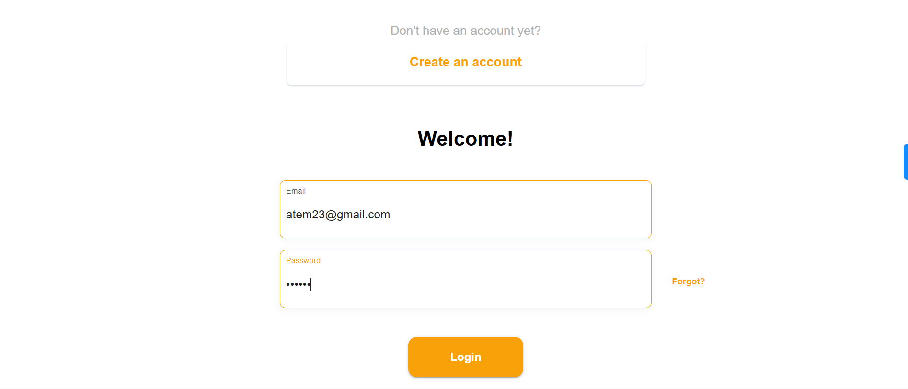
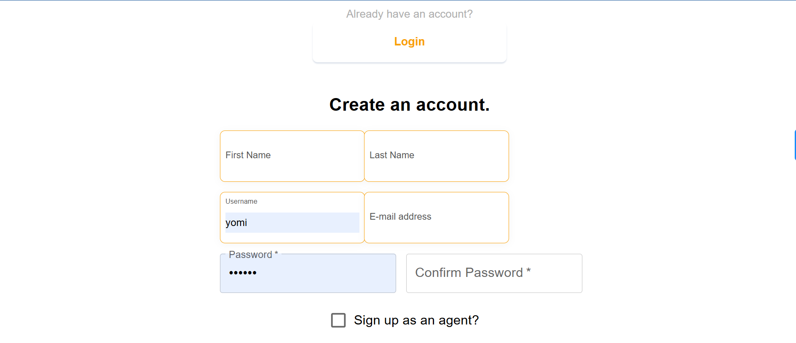
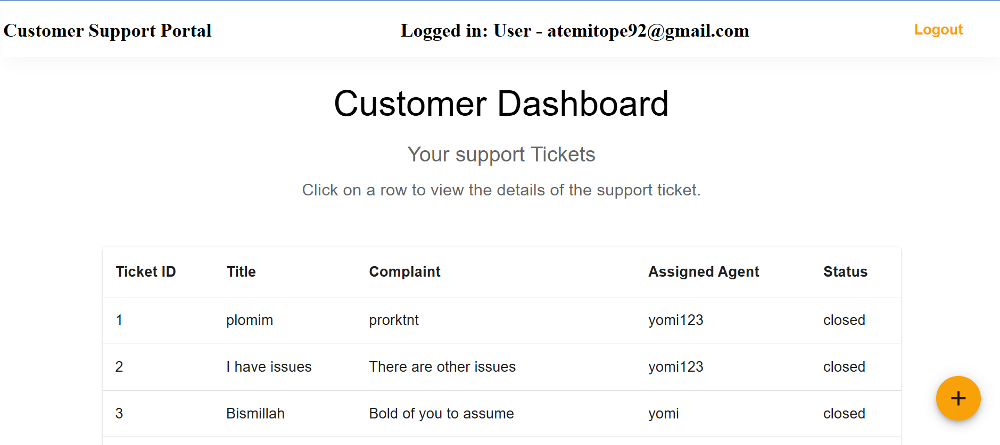
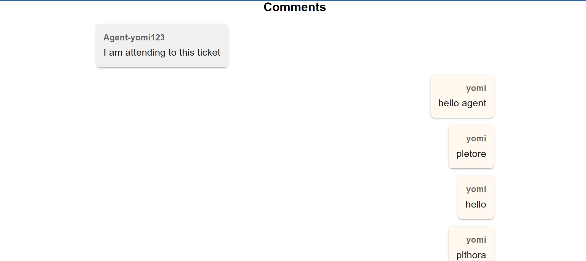

<a name="readme-top"></a>

<!--
!!! IMPORTANT !!!
This README is an example of how you could professionally present your codebase. 
Writing documentation is a crucial part of your work as a professional software developer and cannot be ignored. 

You should modify this file to match your project and remove sections that don't apply.

REQUIRED SECTIONS:
- Table of Contents
- About the Project
  - Built With
  - Live Demo
- Getting Started
- Authors
- Future Features
- Contributing
- Show your support
- Acknowledgements
- License

OPTIONAL SECTIONS:
- FAQ

After you're finished, please remove all the comments and instructions!

For more information on the importance of a professional README for your repositories: https://github.com/microverseinc/curriculum-transversal-skills/blob/main/documentation/articles/readme_best_practices.md
-->

<!-- TABLE OF CONTENTS -->

# 📗 Table of Contents

- [📖 About the Project](#about-project)
  - [🛠 Built With](#built-with)
    - [Tech Stack](#tech-stack)
    - [Key Features](#key-features)
  - [🚀 Live Demo](#live-demo)
- [💻 Getting Started](#getting-started)
  - [Prerequisites](#prerequisites)
  - [Setup](#setup)
  - [Install](#install)
  - [Usage](#usage)
  - [Run tests](#run-tests)
- [👥 Authors](#authors)
- [🔭 Future Features](#future-features)
- [🤝 Contributing](#contributing)
- [⭐️ Show your support](#support)
- [🙏 Acknowledgements](#acknowledgements)
- [❓ FAQ (OPTIONAL)](#faq)
- [📝 License](#license)

<!-- PROJECT DESCRIPTION -->

# 📖 Customer Support Request Portal <a name="about-project"></a>
- This simple portal is a simple web application that allows customers to place support requests and support agents to process the requests.


## 🛠 Built With <a name="built-with"></a>

### Tech Stack <a name="tech-stack"></a>

<details>
  <summary>Client</summary>
   <ul>
    <li><a href="https://reactjs.org/">JavaScript</a></li>
  </ul>
  <ul>
    <li><a href="https://reactjs.org/">React.js</a></li>
  </ul>
   <ul>
    <li><a href="https://redux.js.org/">Redux</a></li>
  </ul>
   <ul>
    <li><a href="https://redux-toolkit.js.org/">Redux Tool Kit</a></li>
  </ul>
   <ul>
    <li><a href="https://cloudinary.com/">Cloudinary</a></li>
  </ul>
</details>

<details>
  <summary>Server</summary>
  <ul>
    <li><a href="https://www.ruby-lang.org/en/">Ruby</a></li>
  </ul>
  <ul>
    <li><a href="https://rubyonrails.org/">Ruby on Rails</a></li>
  </ul>
  <ul>
    <li><a href="https://graphql.org/">GraphQL</a></li>
  </ul>
  <ul>
    <li><a href="https://github.com/waiting-for-dev/devise-jwt">Devise JWT</a></li>
  </ul>
</details>

<details>
<summary>Database</summary>
  <ul>
    <li><a href="https://www.postgresql.org/">PostgreSQL</a></li>
  </ul>
</details>

<!-- Features -->

### Key Features <a name="key-features"></a>

The system was designed to implement the following specifications:

For customers:
1. Users can create support requests/Requests and view the status of previous requests/Requests.
2. Users can reply to updates for the previous requests.  
3. Users can upload images.

For support agents
1. Agents can view and respond to support requests
2. Agen can export CSV reports for closed Requests in the last month
3. Agents receive a daily reminder email containing a list of open Requests

Some other functional requirements include: 
1. Users (Agents or customers) must sign up before using the portal.
2. Users can sign up as an agent or a customer
3. The comment section is a follow-up conversation between a customer and a support agent. 
 - A customer can only comment on a Request if and only if a support agent has commented.
 - The first agent to comment on the Request is automatically assigned that Request.
 - Only an agent assigned to the Request can close the Request.
 - When a Request is closed by the agent, no further comments can be made on the Request.

<p align="right">(<a href="#readme-top">back to top</a>)</p>

<!-- LIVE DEMO -->

## 🚀 Live Demo <a name="live-demo"></a>


- [Live Demo](https://wande-support-portal.netlify.app/)
- [Backend Repository](https://github.com/mckent05/Requesting_backend)

<p align="right">(<a href="#readme-top">back to top</a>)</p>

<!-- GETTING STARTED -->

## 💻 Getting Started <a name="getting-started"></a>

To get a local copy up and running, follow these steps.

### Prerequisites

To run this project, you need:

### Setup

Clone this repository to your desired folder:
- To get started, open your command prompt or bash terminal and run:
```sh
  git clone https://github.com/mckent05/Requestingfront
```

- Next, navigate to the repository folder you just cloned by running the command:
 ```sh
  cd Requestingfront
```
- Open your IDE, for VS Code run:
```sh
code.
```

### Install

Install this project with:

- Install the dependencies/libraries for this application:
```sh
  npm install
```

### Usage

To run the project, execute the following command:

- Finally, run the server:
```sh
  npm start
```

### Run tests

To run tests, run the following command:

```sh
  npm tests
```

### USER INTERFACE

Login page                             |  Signup page
:---------------------------------------:|:---------------------------------------:
       |   

Customer Dashboard page view           |  Request Details page
:---------------------------------------:|:---------------------------------------:
      |  

New Request page view                   |  Comments section view
:---------------------------------------:|:---------------------------------------:
      |   

<p align="right">(<a href="#readme-top">back to top</a>)</p>

<!-- AUTHORS -->

## 👥 Authors <a name="authors"></a>

> Mention all of the collaborators of this project.

👤 **Author1**

- GitHub: [@githubhandle](https://github.com/mckent05)
- Twitter: [@twitterhandle](https://twitter.com/mckent05)
- LinkedIn: [LinkedIn](https://linkedin.com/in/temitopeakinlade)


<p align="right">(<a href="#readme-top">back to top</a>)</p>

<!-- FUTURE FEATURES -->

## 🔭 Future Features <a name="future-features"></a>

> Describe 1 - 3 features you will add to the project.

- Use a web-socket to make the chat between the customer and agent be in real-time, which would ensure a better user experience
- Requests can be reopened even after it has been closed

<p align="right">(<a href="#readme-top">back to top</a>)</p>

<!-- CONTRIBUTING -->

## 🤝 Contributing <a name="contributing"></a>

Contributions, issues, and feature requests are welcome!

Feel free to check the [issues page](../../issues/).

<p align="right">(<a href="#readme-top">back to top</a>)</p>

<!-- SUPPORT -->

## ⭐️ Show your support <a name="support"></a>

If you like this project, please drop a like or reach out to me on any of my social media pages.

<p align="right">(<a href="#readme-top">back to top</a>)</p>

<!-- ACKNOWLEDGEMENTS -->

## 🙏 Acknowledgments <a name="acknowledgements"></a>

I would like to thank the Tix Africa team for the opportunity to work on this assessment, and I look forward to their review.

<p align="right">(<a href="#readme-top">back to top</a>)</p>

<!-- FAQ (optional) -->

## ❓ FAQ (OPTIONAL) <a name="faq"></a>

> Add at least 2 questions new developers would ask when they decide to use your project.

- **[Question_1]**

  - [Answer_1]

- **[Question_2]**

  - [Answer_2]

<p align="right">(<a href="#readme-top">back to top</a>)</p>

<!-- LICENSE -->

## 📝 License <a name="license"></a>

This project is [MIT](./LICENSE) licensed.

_NOTE: we recommend using the [MIT license](https://choosealicense.com/licenses/mit/) - you can set it up quickly by [using templates available on GitHub](https://docs.github.com/en/communities/setting-up-your-project-for-healthy-contributions/adding-a-license-to-a-repository). You can also use [any other license](https://choosealicense.com/licenses/) if you wish._

<p align="right">(<a href="#readme-top">back to top</a>)</p>
